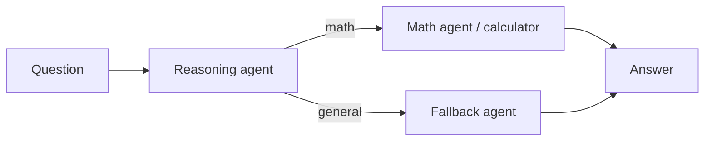

# Toolroom: Tool-Using Agentic Workflow

Toolroom is a small LangGraph application that routes questions to the right response path. Arithmetic questions are converted into Python expressions and evaluated by a calculator tool. Definitions, explanations, and other non-arithmetic questions go to a general-purpose fallback responder.

## Workflow



The reasoning agent classifies each question and produces an expression only for basic arithmetic. The conditional graph routes that decision to either the math tool or fallback. Both paths return a consistent `answer`; math responses also include the generated `expression` and numeric `result`.

## Requirements

- Python 3.10 or newer
- An OpenAI API key

## Setup

From the repository root, create and activate a virtual environment, then install the dependencies:

```powershell
py -m venv .venv
.\.venv\Scripts\Activate.ps1
python -m pip install -r requirements.txt
```

Create a `.env` file in the repository root and add your key:

```dotenv
OPENAI_API_KEY=your-openai-api-key
```

The `.env` file is ignored by Git. Do not commit API keys.

## Run the Streamlit app

```powershell
streamlit run app.py
```

The app keeps the conversation in the current browser session, displays the selected response path, and shows the expression for math answers. Use **Clear conversation** in the sidebar to start a fresh session.

## Run the command-line example

```powershell
python -m patterns.tool_using.run
```

## Project layout

```text
app.py                       Streamlit chat interface
config/llm.py                Chat model setup and .env loading
patterns/tool_using/graph.py LangGraph nodes and conditional routing
patterns/tool_using/nodes.py Reasoning, math, and fallback agents
patterns/tool_using/state.py Shared workflow state
tools/calculator.py          Arithmetic expression calculator
```

## Notes

- The model is configured as `gpt-4o-mini` in `config/llm.py`.
- The calculator expects a basic arithmetic expression generated by the reasoning agent. Avoid using this project to evaluate untrusted Python expressions.
- Model responses depend on the configured API credentials and provider availability.
