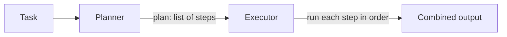

# Planner-Executor Pattern: Beginner Guide

## What this pattern does

The planner-executor pattern separates a task into two phases:

1. A **planner** breaks the user's task into smaller steps.
2. An **executor** works through those steps one at a time and combines the responses.

For example, instead of asking a model to launch into a broad task all at once, the workflow first creates a short plan and then asks the model to complete each step.

In this project, both the planner and executor use the same language model. The executor is not currently calling external tools, running Python code, or performing actions on your computer. It asks the model to write a response for each plan step.

## How the workflow moves



LangGraph passes a shared state from node to node. The planner adds `plan`; the executor reads that plan and adds `output`.

## Files and responsibilities

| File | Responsibility |
| --- | --- |
| `patterns/planner_executor/run.py` | Creates a graph, provides `run_task`, and runs a sample task when launched as a module. |
| `patterns/planner_executor/graph.py` | Connects the planner node to the executor node and ends the graph. |
| `patterns/planner_executor/nodes.py` | Implements the planner prompt and the step-by-step executor. |
| `patterns/planner_executor/state.py` | Defines the data passed between graph nodes. |
| `config/llm.py` | Loads `.env` and creates the `gpt-4o-mini` chat model. |

## Step by step

### 1. The runner supplies a task

`run.py` calls `build_graph()` and then invokes the compiled graph with an initial state:

```python
{"task": "Create a simple 3-step plan for launching an AI chatbot product."}
```

`app.invoke(...)` starts the workflow and returns the final state as a dictionary.

### 2. The graph chooses the order

`graph.py` registers two nodes:

- `planner`: creates the plan.
- `executor`: responds to each step.

The graph sets `planner` as its entry point, adds an edge from `planner` to `executor`, and ends after `executor`. This is a fixed, sequential path; it does not loop or choose between different nodes.

### 3. The planner writes a list

In `nodes.py`, `planner` sends the task to the model with instructions to:

- Create at most three steps.
- Start each step with a dash (`-`).
- Avoid extra explanations around the list.

The returned text is split at newline characters and saved in `state["plan"]`. The plan is a Python list of strings, for example:

```python
[
    "- Identify the target customers",
    "- Build and test the chatbot",
    "- Launch it and gather feedback",
]
```

The exact wording is generated by the model and can vary.

### 4. The executor handles steps in order

The executor loops over `state["plan"]`. It trims whitespace and skips blank lines or lines that do not start with `-`. For each remaining step, it sends a new prompt to the model and appends the response to a results list.

At the end, the executor joins the responses with blank lines and stores the combined text in `state["output"]`.

This is sequential execution: step 2 starts after the model has responded to step 1. The code does not automatically pass the earlier response into the next step's prompt; each prompt currently contains that step only.

## Understanding the state

`PlanState` in `state.py` describes the values used by the graph:

| Key | Meaning |
| --- | --- |
| `task` | The original request from the user. |
| `plan` | The list of steps created by the planner. |
| `output` | The executor's combined responses. |

The initial invocation supplies `task`. Each node returns a small dictionary containing the values it adds. LangGraph combines those returned values into the graph state and makes them available to later nodes.

## Run the example

From the repository root, install dependencies and set `OPENAI_API_KEY` in the root `.env` file as described in [README.md](README.md). Then run:

```powershell
python -m patterns.planner_executor.run
```

The script sends its sample task to the model and prints the final state as formatted JSON. The model call requires an active API key and network access.

## Use the graph with your own task

You can invoke the graph directly from another Python file:

```python
from patterns.planner_executor.graph import build_graph

workflow = build_graph()
result = workflow.invoke({"task": "Prepare a beginner study plan for Python."})

print("Plan:")
for step in result["plan"]:
    print(step)

print("\nOutput:")
print(result["output"])
```

This example imports `build_graph` rather than `run_task` from `run.py`. The current `run.py` has a sample invocation at module level, so importing that module also runs the sample task.

## Current limitations

- The three-step limit is an instruction in the prompt, not a limit enforced by Python code.
- The executor only processes lines that start with `-`. If the planner returns a different format, those lines are skipped.
- The executor asks the language model to produce text; it does not call real-world tools or verify that an action was completed.
- Later steps do not receive earlier step responses as context.
- There is no retry, plan validation, or error recovery if a model request fails.
- The graph has a fixed planner-then-executor path and does not re-plan based on results.

These are natural places to extend the pattern: validate the plan structure, pass completed work into later steps, add real tools, and handle failures or re-planning.